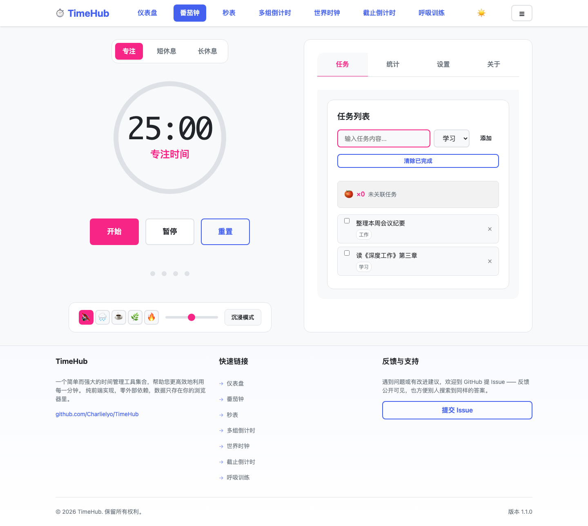
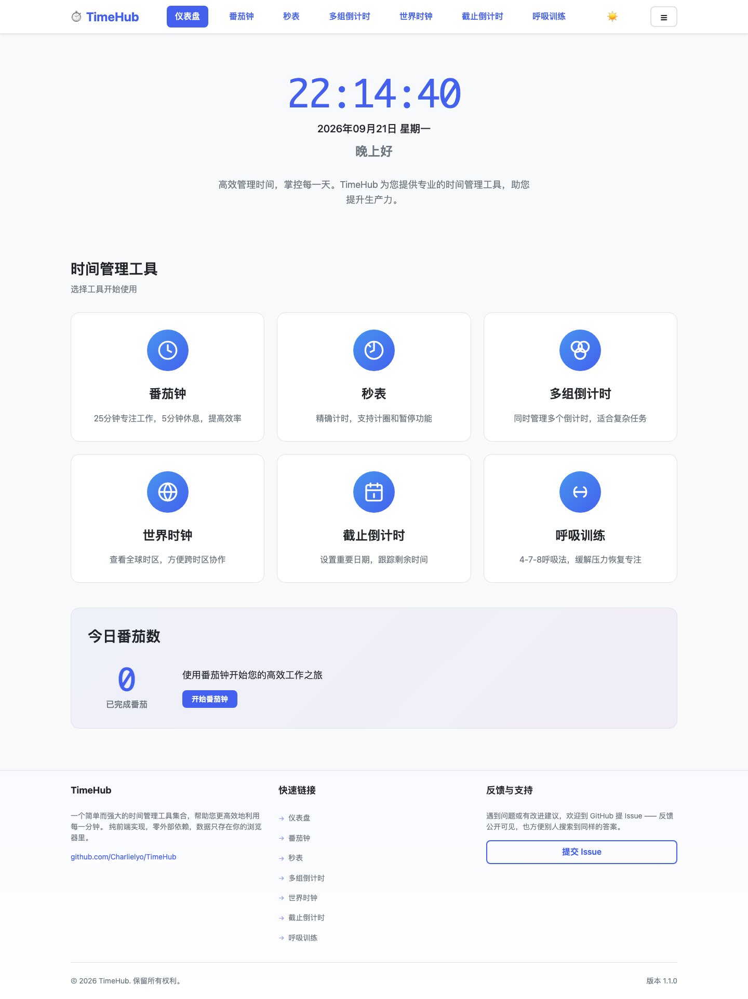
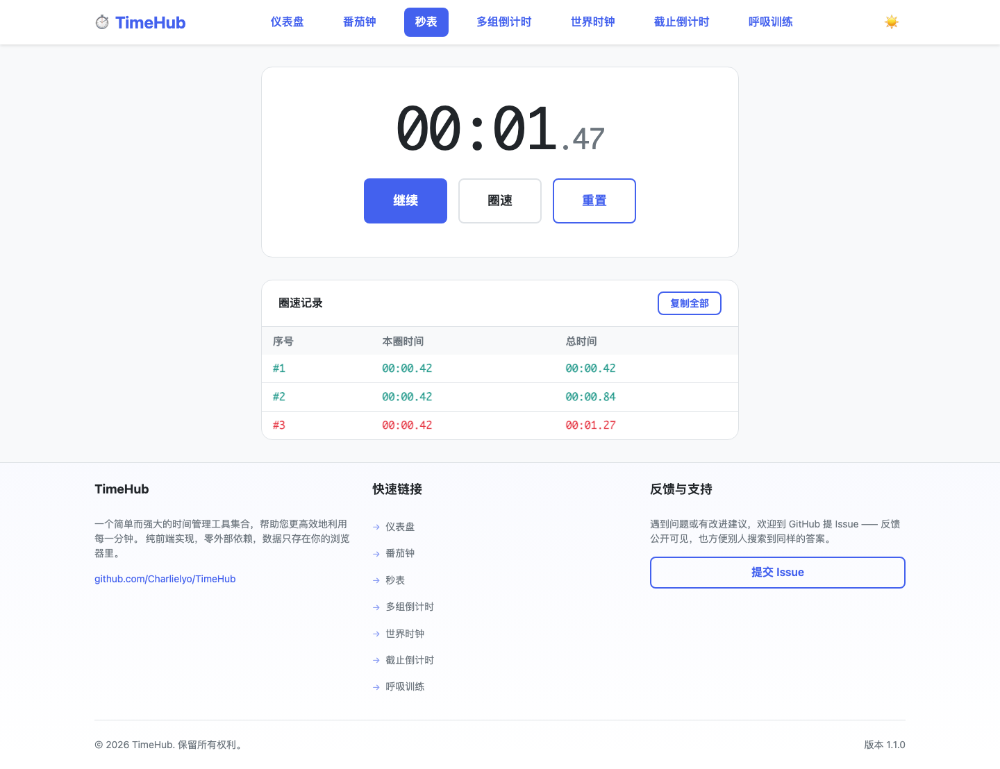
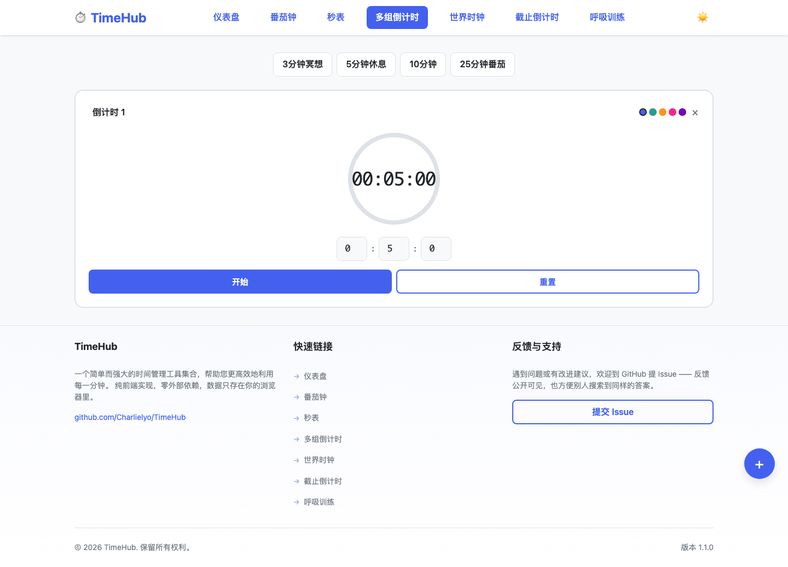
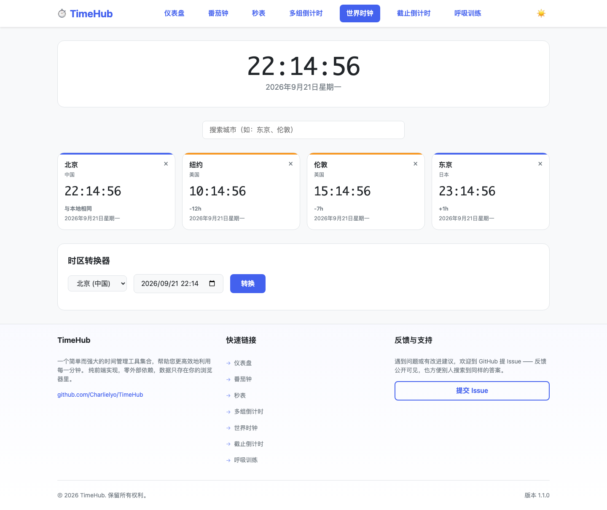
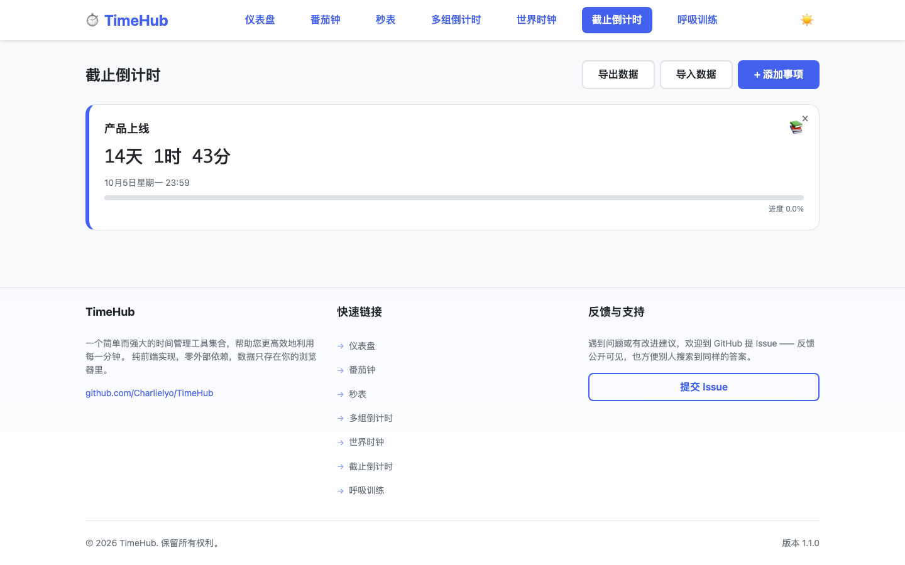
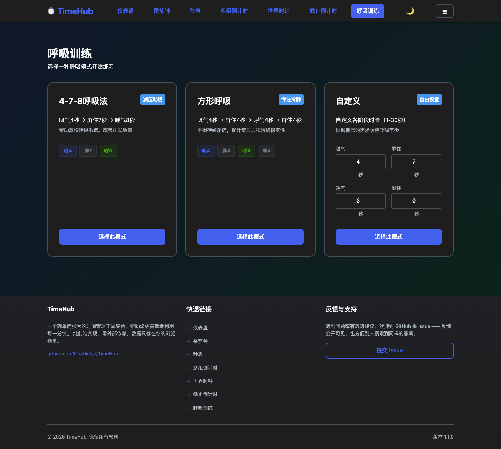
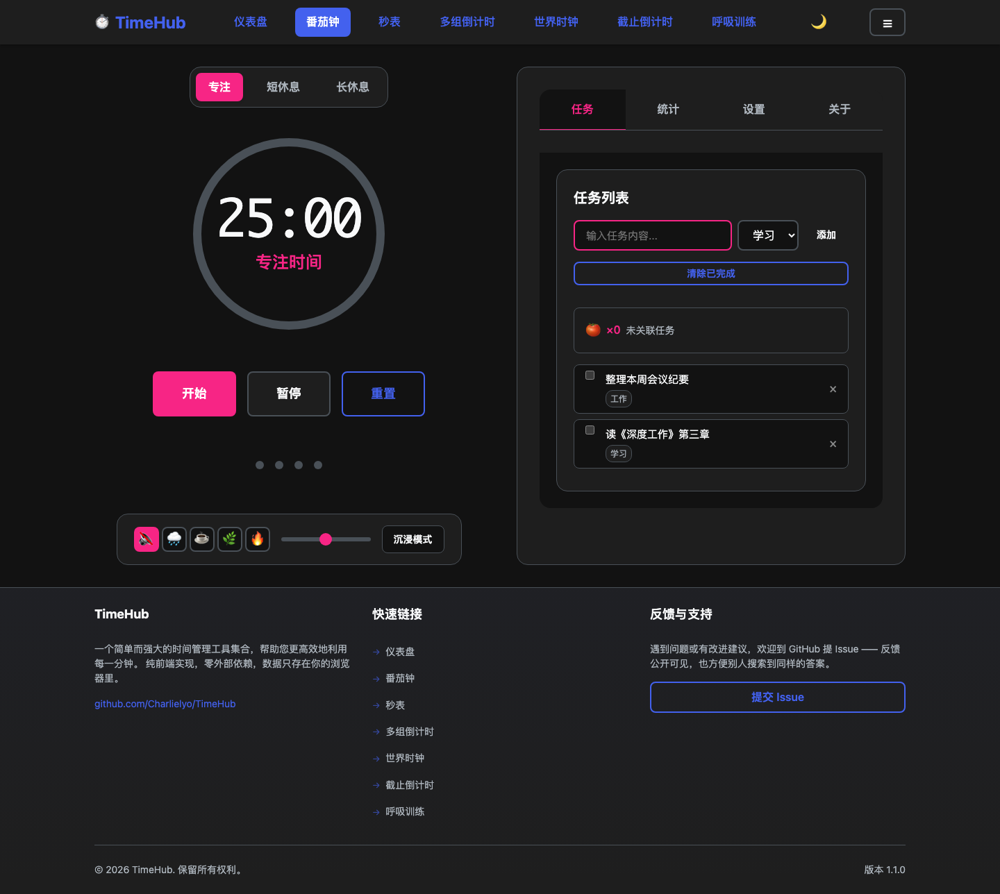

# TimeHub · 时间管理工具集

一套纯前端的在线时间管理工具，六个常用计时器开箱即用，无需注册、无需后端、数据只存在你自己的浏览器里。

**在线使用**：部署后访问站点首页即可（本地运行方式见下方[快速开始](#快速开始)）。

---

## 界面预览

**番茄钟** —— 计时、任务、白噪音、沉浸模式都在这一个页面里：



**六个工具**：

| | | |
|---|---|---|
|  |  |  |
| **仪表盘**：实时时钟 + 工具入口 + 今日番茄数 | **秒表**：毫秒计时，圈速自动标最快/最慢 | **多组倒计时**：多个倒计时并行管理 |
|  |  |  |
| **世界时钟**：多城市时间 + 时差 + 转换器 | **截止倒计时**：重要日期与进度可视化 | **呼吸训练**：4-7-8 / 方形 / 自定义 |

**深色主题**与**手机端**（深色可跟随系统，也可手动三态切换）：

| 深色主题 | 手机端 |
|---|---|
|  |  |

> 截图取自真实运行状态，可直接对照 [v1.1.0](CHANGELOG.md) 的实际界面。

---

## 功能

| 工具 | 说明 |
|---|---|
| 🍅 **番茄钟** | 番茄工作法计时（25 分钟专注 / 5 分钟短休息 / 15 分钟长休息）；任务列表与分类；白噪音（雨声、咖啡馆、森林、篝火）；沉浸模式；番茄统计与历史记录 |
| ⏱️ **秒表** | 毫秒级计时；圈速分段记录并标记最快/最慢；一键复制全部记录；键盘快捷键 |
| ⏰ **多组倒计时** | 同时管理多个倒计时；预设常用时长；自定义标签与配色；到时提醒 |
| 🌐 **世界时钟** | 多城市实时时间；昼夜标识；时差显示；时区转换器 |
| 📅 **截止倒计时** | 记录重要日期与剩余天数；分类管理；进度可视化；数据导入导出 |
| 🧘 **呼吸训练** | 4-7-8 呼吸法、方形呼吸、自定义节奏；呼吸圆圈动画与阶段提示 |

**通用能力**：深浅主题（可跟随系统）、响应式布局（手机 / 平板 / 桌面）、PWA 可安装并离线使用、localStorage 数据持久化、JSON 导入导出。

## 技术栈

- **原生三件套**：Vanilla JavaScript + CSS3 + HTML5，无框架、无构建步骤、无依赖
- **样式**：CSS 自定义属性（变量）驱动的主题系统
- **存储**：localStorage（数据不离开浏览器）
- **离线**：Service Worker + Web App Manifest
- **外部依赖**：**零**。不加载任何 CDN、字体或第三方脚本，克隆下来就能跑

## 快速开始

### 本地运行

因为用了 Service Worker，需要经由 HTTP 访问（直接双击 HTML 文件无法注册 SW）：

```bash
git clone https://github.com/Charlielyo/TimeHub.git timehub && cd timehub
python3 -m http.server 8000
```

然后打开 <http://localhost:8000>。

任何静态服务器都可以，例如 `npx serve`、`php -S localhost:8000`、VS Code 的 Live Server 插件。

### 部署

纯静态站点，把整个目录传到任意静态托管即可：Nginx / Apache / 宝塔面板 / GitHub Pages / Vercel / Netlify。

详细的宝塔面板 + Nginx 配置（含缓存头、gzip、HTTPS）见 [DEPLOY.md](DEPLOY.md)。

> **部署注意**：`sw.js` 必须能不被长期缓存地访问（建议 `Cache-Control: no-cache`），
> 否则用户会一直拿到旧版本的 Service Worker。DEPLOY.md 里有对应配置。

## 项目结构

```
TimeHub/
├── index.html              仪表盘（实时时钟 + 工具入口 + 今日番茄数）
├── pomodoro.html           番茄钟
├── stopwatch.html          秒表
├── countdown.html          多组倒计时
├── worldclock.html         世界时钟
├── deadline.html           截止倒计时
├── breathing.html          呼吸训练
├── 404.html                自定义 404（静态托管需自行配置为错误页）
├── multi-timer.html        旧地址 → countdown.html（重定向）
├── world-clock.html        旧地址 → worldclock.html（重定向）
│
├── css/
│   ├── base.css            主题变量、重置样式、深浅配色（主题机制说明在此文件开头）
│   ├── layout.css          导航栏、页脚、栅格等全局布局
│   ├── components.css      按钮、卡片、表单等通用组件
│   ├── dashboard.css       仪表盘专用
│   └── breathing.css       呼吸训练专用
│
├── js/
│   ├── common.js           全站公共逻辑：命名空间、主题、存储、Toast、导航
│   ├── utils.js            工具函数库（时间格式化、localStorage 封装等）
│   ├── toast.js            通知组件
│   ├── dashboard.js        仪表盘逻辑
│   ├── pomodoro.js         番茄钟逻辑
│   └── breathing.js        呼吸训练逻辑
│
├── assets/icons/           SVG 图标 + PWA 用的 PNG 图标
├── screenshots/            README 用的界面截图（不参与站点运行，可安全删除）
├── manifest.json           PWA 清单
├── sw.js                   Service Worker（缓存策略说明见文件开头）
├── DEPLOY.md               部署指南
├── CHANGELOG.md            版本变更记录
└── LICENSE                 MIT
```

**关于页面里样式与脚本的位置**：仪表盘、番茄钟、呼吸训练三个页面较重，样式写在各自 HTML 的
`<style>` 里、逻辑放在 `js/` 下；秒表、多组倒计时、世界时钟、截止倒计时四个页面是自包含的，
样式与逻辑都在自己的 HTML 内。改动时按页面各自的方式改，不要误以为每个页面都有配套的
`css/xxx.css`。

## 开发须知

改动代码前，有三处机制值得先看一眼——它们是这个项目踩过坑之后定下来的，改了会引发连锁问题：

### 1. 主题只有一个入口：`<html data-theme="light|dark">`

- `js/common.js` 解析用户选择（`auto` 会跟随系统）后，把**最终生效**的主题写进 `data-theme`
- 每个页面的 `<head>` 里有一段内联脚本，在首次绘制前先写一次，避免刷新时闪白/闪黑
- 组件样式一律用 `[data-theme="dark"]` 前缀

> ⚠️ **不要**用 `@media (prefers-color-scheme: dark)` 写深色样式。
> 那种写法只认系统设置、不认站内切换按钮，会导致"点了切换没反应"。
> 项目早期就是两套机制并存，修了很久才理清。

### 2. Service Worker 的策略是有意为之的

`sw.js` 里：HTML 走网络优先，CSS/JS 走"缓存优先 + 后台更新"，其余静态资源缓存优先。

> ⚠️ **不要**把 CSS/JS 也改成纯缓存优先——那样改完代码用户永远看不到，
> 只能等缓存名变化。项目早期就是这个策略，踩过一次。

**发版流程**：改完代码后，把 `sw.js` 的 `VERSION` 和 `js/common.js` 的 `CONSTANTS.VERSION`
一起加号（两处要一致），新 Service Worker 安装时会清掉旧缓存。

### 3. 数据存储只有一个来源

localStorage 的 `timehub_data` 是唯一数据源，`js/common.js` 里的 `TimeHub.getStorage()/saveStorage()`
是统一的读写入口。番茄钟自己的数据（任务、历史）用独立 key 存，通过 `TimeHubUtils` 读写。

### 本地调试

- 改完 CSS/JS 记得在 DevTools → Application → Service Workers 勾选 **Update on reload**，
  否则你看到的可能仍是缓存版本
- 想彻底清干净：DevTools → Application → Storage → Clear site data

## 浏览器支持

| 浏览器 | 版本 |
|---|---|
| Chrome / Edge | 90+ |
| Safari（macOS / iOS） | 14+ |
| Firefox | 88+ |

使用了 CSS 自定义属性、`:where()`、`Promise.allSettled`、Service Worker 等特性，
不支持 IE。

## 已知限制

- **数据存在浏览器本地**：换浏览器、换设备、清理浏览器数据都会丢，重要数据请用导出功能备份
- **番茄钟历史记录上限 100 条**，超出后旧记录会被挤出
- **白噪音为程序生成的音频**，不是真实录音采样
- **多组倒计时的提醒依赖页面处于打开状态**，浏览器后台标签页的定时器会被节流
- **无后端**，因此没有账号体系、没有跨设备同步、没有服务端备份

## 参与贡献

欢迎提交 Issue 与 Pull Request。动手前请：

1. 阅读上面[开发须知](#开发须知)里的三处机制说明
2. 保持零依赖——不要引入框架、构建工具或外部 CDN
3. 改动后自测深浅两套主题 + 手机/桌面两种宽度
4. 用户可见的变化写进 [CHANGELOG.md](CHANGELOG.md)

## 版本

当前版本 **v1.1.0**，变更记录见 [CHANGELOG.md](CHANGELOG.md)。

## 许可证

[MIT](LICENSE) —— 可自由使用、修改、商用，保留版权声明即可。
